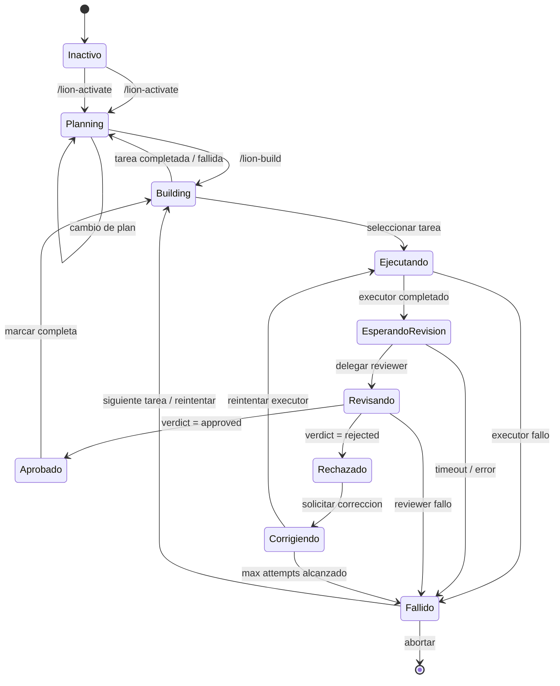
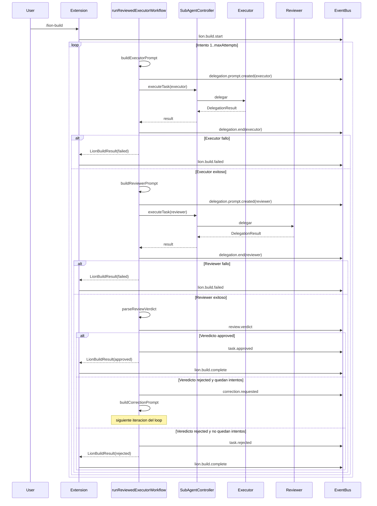
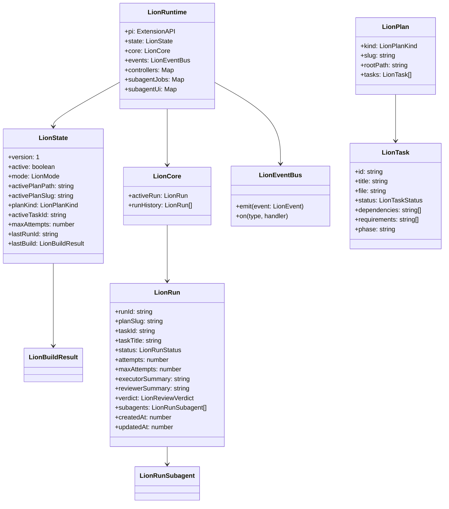

# Lion Extension

Extension de orquestacion para pi coding agent que proporciona planificacion estructurada, ejecucion de tareas con subagentes y revision automatica de codigo.

## Diagrama de Estado

El siguiente diagrama muestra el flujo completo de estados de Lion, desde la activacion hasta la finalizacion de una tarea:



## Arquitectura del Runtime

```mermaid
graph TB
    subgraph "Extension API"
        CMD[Commands<br/>/lion-activate<br/>/lion-build]
        UI[UI Updates<br/>Status / Widget]
    end

    subgraph "Lion Runtime"
        direction TB
        STATE[LionState<br/>mode | plan | task]
        CORE[LionCore<br/>activeRun | runHistory]
        EVENTS[LionEventBus<br/>pub/sub eventos]

        subgraph "Subagent Management"
            CTRL[Controllers<br/>Map&lt;runId, Controller&gt;]
            JOBS[SubagentJobs<br/>Map&lt;taskId, Job&gt;]
            UI_STATE[SubagentUi<br/>Map&lt;taskId, UiState&gt;]
            RETAINED[RetainedInstances<br/>Map&lt;taskId, Subagent&gt;]
        end
    end

    subgraph "Persistencia"
        P_STATE[Estado<br/>lion-state entries]
        P_CORE[Core<br/>lion-core entries]
    end

    subgraph "Estrategias"
        REV[Review Verdict Parser]
        VAL[Plan Validation]
        WORKFLOW[Reviewed Executor Workflow]
    end

    subgraph "Planes"
        DETECT[Detect Kind]
        STRUCT[Structured Plan Loader]
        SELECT[Task Selection]
    end

    CMD --> STATE
    STATE --> CORE
    CORE --> EVENTS
    EVENTS --> UI

    CORE --> CTRL
    CTRL --> JOBS
    JOBS --> UI_STATE
    RETAINED -.-> CTRL

    STATE --> P_STATE
    CORE --> P_CORE

    WORKFLOW --> REV
    WORKFLOW --> VAL
    CORE --> WORKFLOW

    STATE --> DETECT
    DETECT --> STRUCT
    STRUCT --> SELECT
    SELECT --> CORE
```

## Flujo de Eventos (Build Pipeline)



## Modelo de Datos



## Estados de Ejecucion (LionRunStatus)

| Estado | Descripcion |
|--------|-------------|
| `idle` | Sin run activo |
| `executing` | Executor trabajando en la tarea |
| `awaiting_orchestrator` | Esperando decision del orquestador |
| `reviewing` | Reviewer evaluando el resultado |
| `correcting` | Solicitando correccion despues de rechazo |
| `approved` | Tarea aprobada por reviewer |
| `rejected` | Tarea rechazada (puede reintentar) |
| `failed` | Fallo definitivo (executor o reviewer) |
