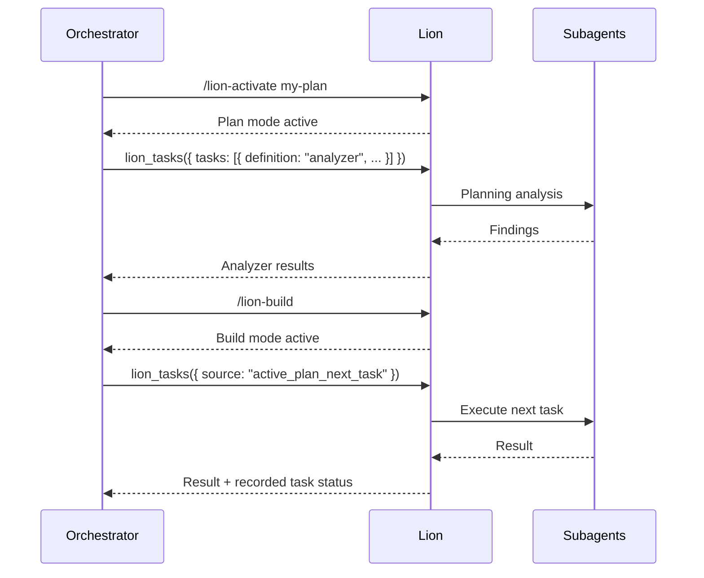
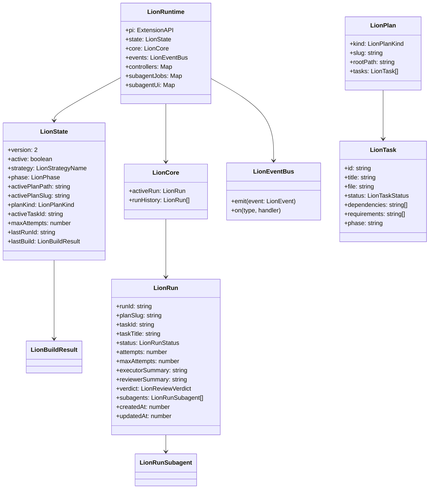

# Lion Extension

Lion is an orchestration extension for the pi coding agent. It provides structured planning, plan activation, and phase-aware subagent delegation.

## Design Principle

Lion keeps build authorization in slash commands and routes all model-facing subagent delegation through `lion_tasks`.

- Lion has four strategies: `none`, `simple`, `plan`, and `review`.
- `none` is the default when Lion is not active. No orchestration prompt is injected and subagents are used on demand.
- `simple` is lightweight orchestration without a durable plan.
- `plan` is durable structured planning with checklist tracking.
- `review` is read-only code review with durable `.reviews/` checklists.
- `lion_activate_plan` may select or switch the active plan, but it does not authorize implementation.
- In planning mode, `lion_tasks` may run analyzer, planner, reviewer, or validator subagents as read-only delegations.
- `/lion-validate` injects validation instructions back into the orchestrator; the orchestrator must use `lion_tasks` for the validator delegation.
- In build mode, `lion_tasks` may execute the next active-plan task or explicit executor/reviewer/analyzer delegations.

## Usage Flow



## Tools

### Commands

| Command | Strategy | Purpose |
|---------|----------|---------|
| *(default)* | `none` | Lion is available but not actively orchestrating. Subagents on demand. |
| `/lion-simple` | `simple` | Activate lightweight orchestration without a durable plan. |
| `/lion-activate` | `plan` | Activate durable plan mode, optionally with a plan reference. |
| `/lion-code-review` | `review` | Create a durable read-only code review plan. |
| `/lion-build` | — | Allow build/execution roles and active-plan task execution. |
| `/lion-validate` | — | Ask the orchestrator to validate the active plan through `lion_tasks`. |
| `/lion-dashboard` | — | Open the Lion subagent dashboard and expose its URL in status. |

### Model-Facing Tool

| Tool | Purpose |
|------|-----------|
| `lion_activate_plan` | Resolve and activate a plan reference; keeps Lion in planning mode |
| `lion_tasks` | Phase-aware subagent delegation for planning analysis and build execution |

## Usage Example

```typescript
// Planning phase: analysis only
lion_tasks({
  strategy: "parallel",
  tasks: [
    {
      definition: "analyzer",
      title: "Map package runtime",
      prompt: "<delegation>...</delegation>"
    }
  ]
})

// Build phase: execute the next active-plan task and record its result
lion_tasks({
  source: "active_plan_next_task",
  role: "executor",
  strategy: "sequential"
})
```

## Strategies

| Strategy | Active | Phase | Plan Required | Use Case |
|----------|--------|-------|---------------|----------|
| `none` | `false` | `planning` | No | Default state. Chat normally, subagents on demand. |
| `simple` | `true` | `building` | No | Lightweight delegation without durable tracking. |
| `plan` | `true` | `planning` / `building` | Yes | Structured plan with checklist and task dependencies. |
| `review` | `true` | `planning` / `building` | Yes | Read-only code review with `.reviews/` checklist. |

## Modelo de Datos



## Estados de Tarea (LionTaskStatus)

| Estado | Descripcion |
|--------|-------------|
| `pending` | Tarea pendiente de ejecucion |
| `in_progress` | Tarea en ejecucion |
| `complete` | Tarea completada |
| `blocked` | Tarea bloqueada por dependencias fallidas |
| `retryable` | Tarea que fallo pero puede reintentarse |
